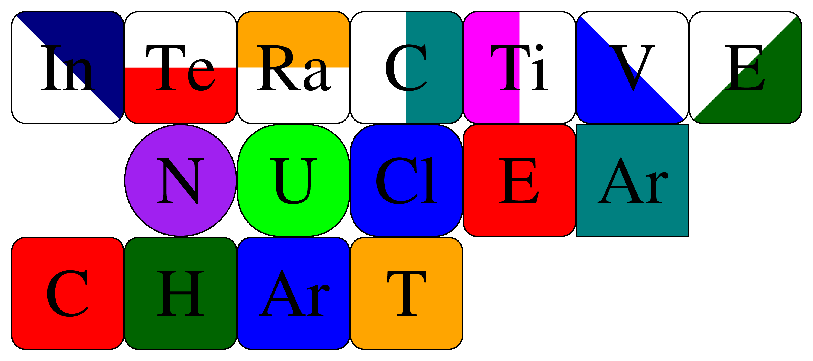

# INCH - the Interactive Nuclear CHart

<p align="center">
    
</p>

---

[](https://travis-ci.com/php1ic/inch)
[](https://gitlab.com/php1ic/inch/pipelines)
[](https://ci.appveyor.com/project/php1ic/inch/branch/master)
[](https://www.gnu.org/licenses/gpl-3.0)

---

INCH is a C++ project aimed at providing a simple method of creating high quality (preferably vector graphic) images of a bespoke region of the nuclear, sometimes referred to as Segre, chart.

No guarantee is supplied with regards to the accuracy of the data presented.
Estimated values are included, please always refer to the original sources.
All data should, however, be accurate.

Suggestions/improvements are encouraged (bugs less so), you can either contact the author or implement the change and send a pull request via [github](https://github.com/php1ic/inch) .

The code can read data from the following published papers:
- The Atomic Mass Evaluation
  - [2003](http://www.sciencedirect.com/science/article/pii/S0375947403018086) - [DOI](http://dx.doi.org/10.1016/j.nuclphysa.2003.11.002)
  - [2012](http://cpc-hepnp.ihep.ac.cn:8080/Jwk_cpc/EN/abstract/abstract2709.shtml) - [DOI](http://dx.doi.org/10.1088/1674-1137/36/12/002)
  - [2016](http://cpc-hepnp.ihep.ac.cn:8080/Jwk_cpc/EN/abstract/abstract8344.shtml) - [DOI](http://dx.doi.org/10.1088/1674-1137/41/3/030002)
- The NUBASE evaluation of nuclear and decay properties
  - [2003](http://www.sciencedirect.com/science/article/pii/S0375947403018074) - [DOI](http://dx.doi.org/10.1016/j.nuclphysa.2003.11.001)
  - [2012](http://cpc-hepnp.ihep.ac.cn:8080/Jwk_cpc/EN/abstract/abstract2725.shtml) - [DOI](http://dx.doi.org/10.1088/1674-1137/36/12/001)
  - [2016](http://cpc-hepnp.ihep.ac.cn:8080/Jwk_cpc/EN/abstract/abstract8343.shtml) - [DOI](http://dx.doi.org/10.1088/1674-1137/41/3/030001)

The data contained within is freely available as ASCII files, all of which are included with the project for ease.
The newer tables are available on the [AMDC](https://www-nds.iaea.org/amdc/) website, and the [historic](http://amdc.in2p3.fr/) page can be used to find older ones.


## Building

The project is built using [cmake](https://cmake.org/) and instructions on building can be found in the file [INSTALL.md](INSTALL.md).
The ability to build with [GNU Make](https://www.gnu.org/software/make/) is still available, but is no longer updated and may be removed.

The following files, within *./data_files/*, should **NOT** be altered.
Although they are all freely available from the above links if they are modified.

```
FRLDM_ME.tbl
mass.mas03
mass.mas12
mass16.txt
nubtab03.asc
nubase.mas12
nubase2016.txt
```

Any other files in *./data_files/* are used for extra functionality and in some cases are recreated if not present.
As always, if you aren't sure, don't change it and if you do, backup!


## Versioning
There is an attempt to follow [SemVer](http://semver.org/) for versioning numbers.
For the currently available versions, see the [tags on this repository](https://github.com/php1ic/inch/tags).

As it currently stands, the available outputs are:

- Creation of the [Encapsulated Postscript (*.eps)](https://en.wikipedia.org/wiki/Encapsulated_PostScript) file
  * with all functionality is complete bar minor tweaks/bug fixes.

- Creation of the [Scalable Vector Graphics (*.svg)](https://www.w3.org/TR/SVG/) file
  * is at the basic stage, a general function exists to position, create
  and colour the box. The addition of nuclei text is in progress.

- Creation of the [TikZ](https://www.ctan.org/pkg/pgf) file
  * is at the basic stage, a general function exists to position, create
  and colour the box whilst adding text.


## License
The code may be freely copied, distributed and altered under the terms of the [GNU GPL v3](https://www.gnu.org/licenses/gpl-3.0.en.html) license.
Please read the file [COPYING](COPYING), which should be located at the root of the project, for full details.
